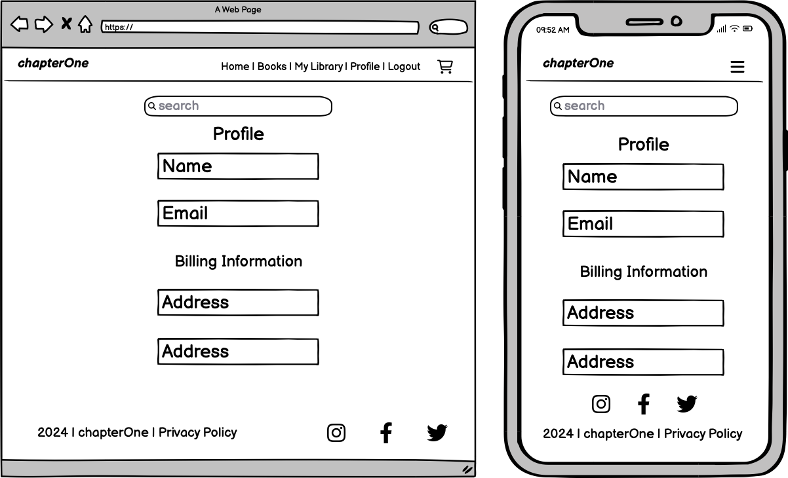

# Chapter One


"Chapter One" is an online bookstore designed to support emerging authors by providing them with a platform to share their work. Focused on selling affordable, digital PDF books, Chapter One aims to connect readers with fresh voices in literature, offering them a unique way to support new authors at the start of their writing journey. With a minimalist design, integrated Stripe payments, and Mailchimp newsletters, Chapter One fosters an accessible environment for both authors and readers passionate about discovering new stories.

**[Link to the deployed application](https://chapter-one-6f5e3972cc2a.herokuapp.com/books/)**

## Index

- [Project Inception](#project-inception) 
- [Customer Goals](#customer-goals) 
- [Business Goals](#business-goals)
- [User Stories](#user-stories)
- [Strategy](#strategy)
- [Scope](#scope)
- [Structure](#structure)
- [Skeleton](#skeleton)
  - [Wireframes](#wireframes)
- [Surface](#surface)
    - [Fonts](#fonts)
    - [Colours](#colours)
- [Features](#features)
- [Future Features](#future-features)
- [Database Schema](#database-schema)
  - [Entity Relationship Diagram](#entity-relationship-diagram)
- [Agile](#agile)
- [Marketing](#marketing)
- [Deploying Project to Heroku](#deploying-project-to-heroku)
- [Gmail Setup](#gmail-setup)
- [AWS Setup](#aws-setup)
- [Stripe Setup](#stripe-setup)
- [Technologies Used](#technologies-used)
- [Credits](#credits)
- [Testing](#testing)

## Project Inception

Chapter One was created with a vision to support and uplift undiscovered writers. The traditional publishing world often presents barriers for new authors, making it difficult to reach an audience or gain financial backing. Chapter One is here to change that, offering a minimalist digital platform where emerging writers can share their works, and readers can support them directly by purchasing their books.

The platform is simple yet impactful, designed to encourage new talent and foster a community of readers who value fresh perspectives. Readers can explore short stories and digital books in various genres, knowing that each purchase directly supports a writer at the beginning of their creative journey.

## Customer Goals

**Chapter One** is designed with two primary customers in mind: new authors and readers who are eager to discover unique literary voices. The platform’s goal is to serve both groups by creating an accessible, encouraging environment that benefits everyone involved.

### For Authors
- **Visibility**: Provide a space for emerging authors to showcase their work to a wider audience.
- **Financial Support**: Enable authors to earn revenue through direct sales of their digital books.
- **Encouragement**: Offer a platform where writers can feel valued and build confidence in their craft.

### For Readers
- **Discovery**: Give readers a curated space to find fresh stories from new voices in literature.
- **Support for New Authors**: Allow readers to support emerging talent directly, contributing to the growth of a writer’s career.
- **Convenience**: Provide a simple, enjoyable experience for browsing, purchasing, and accessing digital books in one place.

## Business Goals

The mission of **Chapter One** is to bridge the gap between emerging authors and readers, providing a mutually beneficial platform that supports creative growth and discovery. The business goals are designed to ensure a sustainable and engaging marketplace for both authors and readers, fostering a community that values fresh literary voices.

### Key Business Goals

- **Support New Authors**: Offer a low-cost platform where new authors can publish and monetize their work without the need for traditional publishing contracts.
  
- **Revenue Generation**: Establish a streamlined revenue model through direct book sales, with **Chapter One** taking a small commission to sustain platform operations while ensuring authors receive a fair share.

- **Encourage Reader Engagement**: Create an enjoyable, simple shopping experience that attracts readers interested in unique stories, fostering loyalty and frequent returns to the platform.

- **Build Brand Recognition**: Grow **Chapter One**'s reputation as the go-to place for discovering undiscovered writers, leveraging social media, Mailchimp newsletters, and community outreach to attract both authors and readers.

## **User Stories**

### **Visitor User Stories**

- **As a visitor**, I can view the site’s home page so that I can understand its purpose and intentions.  
- **As a visitor**, I can use the navigation bar to explore different sections of the site so that I can easily access the content I need.  
- **As a visitor**, I can click on links in the footer so that I can access additional information, such as the privacy policy and social media links.  
- **As a visitor**, I can enter text into the search bar so that I can quickly find books.
- **As a visitor**, I can view a list of all available books so that I can browse through them.  
- **As a visitor**, I can filter books by genre so that I can easily find books that match my interests.  
- **As a visitor**, I can view detailed information about a book so that I can make an informed purchase decision.

---

## **User Authentication User Stories**

- **As a user**, I can register for an account so that I can access personalized features like purchasing books and managing my library.  
- **As a user**, I can log in to my account so that I can access my profile and purchased books.  
- **As a user**, I can log out of my account so that I can prevent unauthorised access. 
- **As a user**, I can edit my profile details so that I can keep my personal and billing information up to date.  

---

## **Shopping Cart and Checkout User Stories**

- **As a user**, I can add books to my cart so that I can purchase items.  
- **As a user**, I can view the contents of my cart so that I can see which books I plan to purchase and their total cost.  
- **As a user**, I can remove books from my cart so that I can adjust my selections before checkout.  
- **As a user**, I can complete my purchase using a secure payment method so that I can download my books immediately.  
- **As a user**, I can receive a confirmation email after completing a purchase so that I have a record of my order details.  

---

## **User Library User Stories**

- **As a user**, I can view my purchased books in a library so that I can keep track of my collection.  
- **As a user**, I can download my purchased books so that I can read them.  

---

## **Author Profiles User Stories**

- **As a user**, I can view a list of all authors on a dedicated page so that I can explore their profiles. 

---

## **Admin Content Management User Stories**

- **As an admin**, I can add new books to the catalog so that they are available for users to browse and purchase.  
- **As an admin**, I can edit existing books so that I can update their details or pricing when needed.  
- **As an admin**, I can delete books from the catalog so that I can remove outdated or incorrect listings.  
- **As an admin**, I can add new authors so that I can feature them in the catalog and link their books.  
- **As an admin**, I can edit author profiles so that I can update their information.  
- **As an admin**, I can delete authors so that I can remove profiles if needed.    

## Strategy

The strategy for **Chapter One** focuses on creating a welcoming platform where emerging authors can reach readers who are interested in discovering fresh literary talents. Key strategic points are centered on platform simplicity, user engagement, and long-term growth.

### Strategic Objectives

- **Simplicity and Accessibility**: Offer a minimalist design and easy navigation, making it intuitive for readers and authors to use. This includes straightforward features, a clear purchase flow, and minimal clicks to buy and access books.

- **Support New Authors**: Keep publishing costs low to attract new writers who may not have access to traditional publishing channels, fostering a community of emerging talent. 

- **Engage and Retain Readers**: Encourage user retention through a library feature for purchased books and regular updates about new releases through a Mailchimp-powered newsletter.

- **Revenue Growth with Digital-Only Sales**: Utilize Stripe integration to facilitate quick, secure purchases of digital content, keeping costs low while focusing on selling PDF books only.

- **Community Building and Marketing**: Use social media platforms, particularly Facebook, to connect with a broader audience, share author stories, and increase awareness of the platform as a place for discovering unique stories.

## Scope

The *Chapter One* project aims to create a simple online bookstore specialising in digital books by new authors. The website focuses on core features essential for smooth user experience and book purchasing, keeping the website accessible and minimal.

- **Book Browsing and Search**:
  - Users can explore a catalog of books, listed with author names, book titles, and genres.
  - A simple search bar to look up books.
  - Genre-based filtering for quick access to books by categories, such as comedy, short stories, and poetry.

- **Product Details and Purchase Flow**:
  - Each book has a product detail page displaying the author's name, book title, genre, a short description, and a purchase button.
  - Upon purchasing, users receive a success message, are redirected to the My Library page, and receive an email confirmation.
  - Purchased books are stored in the user's My Library, where they can download the books anytime.

- **Profile and My Library**:
  - A personalized user profile to manage personal details and billing information.
  - My Library enables users to access all purchased books for download in PDF format.

- **Contact for Authors**:
  - A simple contact form or email link on the homepage for authors to inquire about publishing options.

- **Payment and Newsletter Integration**:
  - Stripe integration for secure and straightforward payments for digital book purchases.
  - Mailchimp integration to send out regular updates about new releases, supporting reader engagement and retention.

- **Mobile Responsiveness and Standard Privacy**:
  - The website will be responsive across mobile, tablet, desktop, and wide monitor sizes.
  - A basic privacy policy.

## Structure

The structure of **Chapter One** is carefully organised to ensure a smooth and intuitive user experience, guiding readers through the website’s core functions.

### Website Structure

1. **Home Page**: 
   - Welcomes users with a literary quote and project overview, providing immediate clarity on the site’s purpose. 
   - Authors can easily locate the contact form for publishing inquiries, while readers are directed to explore available books through the call-to-action button.

2. **Books Page**:
   - Displays a list of books styled as CSS book covers for a visually engaging experience.
   - Includes a search bar enabling users to quickly find books of interest. This page is a focal point where users initiate their discovery journey.

3. **Product Details Page**:
   - Provides detailed information on each book, allowing users to make informed decisions. This page includes a purchase button, serving as the gateway to the checkout process.

4. **Shopping Bag**:
   - Allows users to review selected books and adjust their shopping choices before proceeding. The streamlined checkout process with Stripe integration ensures a secure transaction experience.

5. **My Library**:
   - A dedicated page where users can access purchased books for download, offering a personalized and easily navigable library experience.

6. **Profile Page**:
   - Enables users to manage personal information and view billing details. Integrated with Django Allauth, it ensures secure and easy account management.

7. **Admin Page**:
   - Accessible only to administrators, this page allows the site owner to add, edit, and delete books.

### Navigation

The navigation bar provides easy access to essential pages:
- **Home**, **Books**, **Shopping Bag**, **My Library**, and **Profile**.
- The footer includes links to social media channels and the privacy policy.

## Skeleton

### Wireframes

- **Home page**


- **Books Page**


- **My Library Page**


- **Product Detail Page**


- **Profile Page**



- **Shopping Bag Page**


- **Sign In Page**


## Surface

The **Chapter One** project combines visual design to create a digital space that feels like an extension of a classic printed book. Blending old book aesthetics with a modern touch, the surface layer provides a warm, inviting environment for readers.

### Fonts

To enhance the literary feel, three fonts were selected:
- **Space Mono**: Used for headers, navigation links, and buttons, this monospaced font offers a structured, modern twist reminiscent of a typewriter style, adding a touch of literature-inspired design.
- **Cormorant Garamond**: The main body font, Cormorant Garamond, evokes the look of classic printed books. Its elegant serif style enhances readability, making it ideal for long-form text.
- **Cinzel Decorative**: Used for decorative text, like the logo, adding a touch of elegance and uniqueness.

### Colors


To capture the nostalgic ambience of an aged book, I took inspiration from a real, well-worn volume. By photographing the book pages and extracting colours with a colour picker, I recreated the subtle tones of the old book:

- **Smoky Black (#171310)**: Smoky Black is the main text colour, combining readability and warmth. It echoes the look of printed ink on old book page.
- **Dun (#DED0B7)**: The background colour, Dun, is reminiscent of well-loved, yellowed paper. This gentle tone provides a comfortable reading experience.
- **White (#FFFFFF)**: Used in the navbar, buttons, and other key elements, white provides a modern touch. It stands out against the Dun background and adds a clean contrast that draws attention without overpowering the classic tones.

### Accessibility and Visual Harmony

To enhance readability, colour contrasts meet accessibility standards:
- **Smoky Black on Dun**: With a contrast ratio of 12.15, this combination ensures easy reading against the background.
- **Smoky Black on White**: A ratio of 18.47, making it ideal for navbar and interactive elements.

## Database Schema 

### Entity Relationship Diagram


## Agile

The *Chapter One* project was developed using the **Agile methodology** to stay organized and make steady progress through iterative development.  

### **Approach**  
I started by creating **Epic Stories** to outline the main features and goals of the project. Each epic was then broken down into **User Stories** with **Acceptance Criteria** and **Tasks** to define clear expectations and the steps required to complete them.  

### **Prioritization**  
To prioritize features, I used the **MoSCoW method**:  
- **Must Have** – Essential features required for the project to function.  
- **Should Have** – Important features that improve the user experience but are not critical.  
- **Could Have** – Optional features to include if time permits.  
- **Won't Have** – Features excluded from the current scope but considered for future updates.  

### **Project Board**  
I added **User Stories** as **GitHub Issues** and organized them into **Sprints** to plan and track development. Each sprint focused on delivering specific features.  

The project board was divided into columns to reflect task progress:  
- **Backlog** – Planned work waiting to be started.  
- **To-Do** – Tasks prioritized for the current sprint.  
- **In Progress** – Tasks currently being worked on.  
- **Done** – Completed tasks.  

### **Tracking Progress**  
For a detailed view of the full development process, including sprints, issues, and task status, visit the **GitHub Project Board**:  
[Chapter One Project Board](https://github.com/users/niekados/projects/7)

## Deployment

The *Chapter One* project was developed using **GitPod** with **Git** version control and stored in a **GitHub repository**. GitHub also served as the connection point for deploying the project to **Heroku**.

---

### Database

The project uses **PostgreSQL** as its database, hosted by **Code Institute** using their **PostgreSQL database tool**:  
[Code Institute Database](https://dbs.ci-dbs.net/)

### Prepare the project for deployment:
1. Install required packages `dj_database_url` and `psycopg2`.
2. Add database URL and secret key to environment variables.
3. Update settings.py:
	-	Import the `dj_database_url` package.
	-	Replace the default SQLite database with PostgreSQL using:
    ```bash
    DATABASES = {
      'default': dj_database_url.parse(os.environ.get("DATABASE_URL"))
    }
    ```
4. Install `gunicorn`
5. Create Procfile in the root directory and add the following line: `web: gunicorn chapter_one.wsgi:application`.

### Heroku Deployment
1. Log in to Heroku.
2. Click New → Create New App:
  -	App Name: Enter a unique name for the app.
	-	Region: Select Europe for deployment location.
3. Set Config Vars:
  - Navigate to the Settings tab in Heroku and add the following Config Vars:
    -	SECRET_KEY – The Django secret key.
    -	DATABASE_URL – Code Institute PostgreSQL database.
    -	DISABLE_COLLECTSTATIC – Temporarily set to 1 during initial deployment.
4. Go to the Deploy tab in Heroku.
5. Select GitHub as the Deployment Method.
6. Connect to your repository by searching for the project name.
7. Deploy the branch manually by clicking Deploy Branch. (Optional: Enable Automatic Deploys.)
8. At the end of the project, the following Config Vars will be added in Heroku:
  - `SECRET_KEY` - Used for securely signing in to Django.  
  - `DATABASE_URL` - Connection URL for the PostgreSQL database.  
  - `AWS_ACCESS_KEY_ID` - Access key ID for AWS S3 storage.  
  - `AWS_SECRET_ACCESS_KEY` - Secret access key for AWS S3 storage.  
  - `STRIPE_PUBLIC_KEY` - Public key for Stripe payment.  
  - `STRIPE_SECRET_KEY` - Secret key for Stripe payment.  
  - `STRIPE_WH_SECRET` - Webhook secret key for Stripe.  
  - `EMAIL_HOST_USER` - Email address used to send automated emails.  
  - `EMAIL_HOST_PASS` - Password for the email host.  
  - `USE_AWS` - Flag to enable AWS S3 storage for media and static files. 

## Gmail Setup

The *Chapter One* project uses **Gmail SMTP** for sending emails, such as purchase confirmations and user contact forms. To securely send emails, the following steps were taken:

---

### Gmail Account Setup
1. Log in to an existing Gmail account or create a new one specifically for the project.  
2. Enable **2-Step Verification** in the account’s security settings.  
3. In the Gmail settings search bar, type **"App Passwords"** and follow the steps to create a new **16-digit app password**.   
4. Copy the generated password for later use.

---

### Configure Email Settings in Django
Add the following email configurations to `settings.py`:
```python
if 'DEVELOPMENT' in os.environ:
    EMAIL_BACKEND = 'django.core.mail.backends.console.EmailBackend'
    DEFAULT_FROM_EMAIL = 'chapterone@example.com'
else:
    EMAIL_BACKEND = 'django.core.mail.backends.smtp.EmailBackend'
    EMAIL_USE_TLS = True
    EMAIL_PORT = 587
    EMAIL_HOST = 'smtp.gmail.com'
    EMAIL_HOST_USER = os.environ.get('EMAIL_HOST_USER')
    EMAIL_HOST_PASSWORD = os.environ.get('EMAIL_HOST_PASS')
    DEFAULT_FROM_EMAIL = os.environ.get('EMAIL_HOST_USER')
```
Store sensitive information in environment variables:
- `EMAIL_HOST_USER=youremail@gmail.com`
- `EMAIL_HOST_PASS=your-gmail-app-password`

## AWS Setup

The Chapter One project uses **AWS S3** for storing static and media files.

### Create an AWS Account
1. Register or log in to an existing account at [AWS](https://aws.amazon.com).  
2. Once logged in, search for S3 in the AWS Management Console.  
3. Select S3 from the services list.

### Create an S3 Bucket
1. Click Create bucket.  
2. Enter a Bucket Name — it is recommended to match this with your Heroku app name.  
3. Choose a Region closest to your location.  
4. Object Ownership:
   - Select ACLs enabled.  
   - Choose Bucket owner preferred.  
5. Block Public Access:
6. Deselect Block all public access. 
7. Leave other settings as default and click Create Bucket.

### Enable Static Website Hosting
1. Go to the Properties tab in your bucket.  
2. Scroll to Static website hosting and click Edit.  
3. Enable static hosting and specify:
   - Index Document: `index.html`  
   - Error Document: `error.html`  
4. Save changes.

### Update Permissions

### CORS Configuration
1. Go to the Permissions tab.  
2. Scroll down to Cross-Origin Resource Sharing (CORS) and click Edit.  
3. Add the following code and save:
   ```json
   [
     {
       "AllowedHeaders": ["Authorization"],
       "AllowedMethods": ["GET"],
       "AllowedOrigins": ["*"],
       "ExposeHeaders": []
     }
   ]
   ```

### Bucket Policy
1. Go to the Permissions tab in your bucket settings.  
2. Scroll to Bucket Policy and click Edit.  
3. Use the Policy Generator to create a policy:  
   - Policy Type: S3 Bucket Policy  
   - Principal: "*" (to allow public access)  
   - Action: s3:GetObject  
   - Resource: Copy and paste your bucket ARN and append /* to the end.  
4. Click Generate Policy, then copy and paste the generated policy code.  
5. Save changes.

### Access Control List (ACL)
1. Scroll down to Access Control List (ACL) in the bucket settings and click Edit.  
2. Under Everyone (public access), enable List.  
3. Confirm the changes by acknowledging the warning and click Save.

### Create IAM User and Access Keys  
1. Search for IAM in the AWS Management Console.  
2. Go to User Groups and create a new group.  
3. Attach the AmazonS3FullAccess policy to the group.  

#### Create Policy for Bucket  
1. Go to Policies and click Create Policy.  
2. Use the JSON tab and add the following:  
```json
{
  "Version": "2012-10-17",
  "Statement": [
    {
      "Sid": "Statement1",
      "Effect": "Allow",
      "Action": ["s3:*"],
      "Resource": [
        "arn:aws:s3:::your-bucket-name",
        "arn:aws:s3:::your-bucket-name/*"
      ]
    }
  ]
}
```
3. Save the policy and attach it to the group.

#### Create a User
1.	Go to Users and click Create User.
2.	Assign the user to the previously created group.
3.	Complete the setup and create an Access Key:
-	Select an Application running outside AWS.
-	Download the key .csv file, which contains:
-	AWS_ACCESS_KEY_ID
-	AWS_SECRET_ACCESS_KEY

### Configure Django Settings

1. Install required packages: `boto3` `django-storages`.
2. Update settings.py:
```bash
    # Bucket Config
    AWS_STORAGE_BUCKET_NAME = 'your-bucket-name'
    AWS_S3_REGION_NAME = 'eu-west-1'
    AWS_ACCESS_KEY_ID = os.environ.get('AWS_ACCESS_KEY_ID')
    AWS_SECRET_ACCESS_KEY = os.environ.get('AWS_SECRET_ACCESS_KEY')
    AWS_S3_CUSTOM_DOMAIN = f'{AWS_STORAGE_BUCKET_NAME}.s3.amazonaws.com'

    # Static and media files
    STATICFILES_STORAGE = 'custom_storages.StaticStorage'
    STATICFILES_LOCATION = 'static'
    DEFAULT_FILE_STORAGE = 'custom_storages.MediaStorage'
    MEDIAFILES_LOCATION = 'media'

    # Override static and media URLS in production
    STATIC_URL = f'https://{AWS_S3_CUSTOM_DOMAIN}/{STATICFILES_LOCATION}/'
    MEDIA_URL = f'https://{AWS_S3_CUSTOM_DOMAIN}/{MEDIAFILES_LOCATION}/'
```

## Stripe Setup

The Chapter One project uses **Stripe** for payment processing in a **test environment**. The following steps outline how to retrieve API keys, set up webhooks, and test payments.

### 1. Retrieve API Keys
1. Log in to [Stripe](https://stripe.com/) or create a free account.  
2. The **Publishable Key** and **Secret Key** are displayed directly on the **Dashboard**.  
3. Copy the keys and add them as environment variables:
  - `STRIPE_PUBLIC_KEY=`
  - `STRIPE_SECRET_KEY=`

### 2. Create a Webhook Endpoint
1. Go to the **Developers** tab (expand the black bar at the bottom-left of the screen if collapsed).  
2. Select **Webhooks** and click **Add Endpoint**.  
3. Enter the webhook URL (e.g., `https://your-app-name.herokuapp.com/checkout/webhook/`).  
4. Select **All Events** to capture all relevant webhook events.  
5. Click **Add Endpoint**.  
6. After saving, copy the **Webhook Secret Key** and add it as an environment variable:
  - `STRIPE_WH_SECRET=`

### 3. Test Card Numbers
Stripe provides test card numbers to simulate different payment scenarios:
- `4242 4242 4242 4242` - Successful Payment
- `4000 0025 0000 3155` - Requires 3D Secure
- Expiry date - any future date
- CVC - any 3 numbers

## Credits

### **Images**

- **Author Placeholder Image**:  
  The placeholder image for authors without a profile photo was sourced from the [Avatar Placeholder website](https://avatar-placeholder.iran.liara.run/). This image is provided for free use.

- **Author Avatars**:  
  Author avatar images used throughout the project were downloaded as a free package from [Untitled UI Avatars](https://www.untitledui.com/avatars). These images are licensed for free commercial use.

