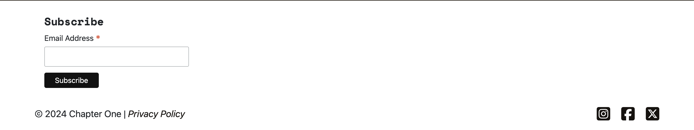

# Testing

## Index

- [Validation](#validation)
    - [HTML Validation](#html-Validation)
    - [CSS Validation](#css-validation)
    - [JavaScript Validation](#javascript-validation)
    - [PEP8 Validation](#pep8-validation)
    - [Lighthouse Testing](#lighthouse-testing)
- [Testing User Stories](#testing-user-stories)
- [Manual Testing](#manual-testing)
- [Bugs](#bugs)
- [Known Bugs](#known-bugs)

## Validation

### HTML Validation

The HTML code for the Journey app was validated using the [W3C Markup Validation Service](https://validator.w3.org/). 

- **Validation Method**:
  - URI validation was employed for all pages that did not require user login.
  - Direct input validation was used for pages that required a login. The HTML code was extracted by viewing the page's source directly. 

#### Warnings:
- The `type` attribute is unnecessary for JavaScript resources. This warning appeared multiple times in the code but was left unchanged as it is not critical and does not impact functionality.

| Page                 | Warnings                          | Errors    |
|----------------------|-----------------------------------|-----------|
| index                | JS type attribute                 | None      |
| add author           | JS type attribute                 | None      |
| authors list         | JS type attribute                 | None      |
| confirm author delete | JS type attribute                 | None      |
| edit author          | JS type attribute                 | None      |
| manage authors       | JS type attribute                 | None      |
| add book             | JS type attribute                 | None      |
| book detail          | JS type attribute                 | None      |
| books list           | JS type attribute                 | None      |
| confirm book delete  | JS type attribute                 | None      |
| edit book            | JS type attribute                 | None      |
| manage books         | JS type attribute                 | None      |
| shopping cart        | JS type attribute                 | None      |
| checkout             | JS type att, empty heading        | None      |
| checkout success     | JS type attribute                 | None      |
| my library           | JS type attribute                 | None      |
| profile              | JS type attribute                 | None      |
| sign in              | JS type attribute                 | None      |
| sign out             | JS type attribute                 | None      |
| sign up              | JS type attribute                 | None      |

### CSS Validation

The CSS files were validated using the [W3C CSS Validator](https://jigsaw.w3.org/css-validator/) with the **Direct Input** method.

#### Validation Results

| CSS File       | Warnings  | Errors |
|----------------|-----------|--------|
| base.css       | None      | None   |
| checkout.css   | None      | None   |
| profiles.css   | None      | None   |

### JavaScript Validation

The JavaScript files were validated using the [Esprima JavaScript Validator](https://esprima.org/demo/validate.html).

#### Validation Results

| JavaScript File          | Warnings    | Errors     |
|--------------------------|-------------|------------|
| elements.js              | None        | None       |
| base.html script section | None        | None       |

### PEP8 Validation

All Python files were validated using the [Code Institute PEP8 Validation Tool](https://pep8ci.herokuapp.com/). The results are summarized below:

| File Name                      | Errors          |
|--------------------------------|-----------------|
| **Authors App**                |                 |
| admin.py                       | None            |
| forms.py                       | None            |
| models.py                      | None            |
| urls.py                        | None            |
| views.py                       | None            |
| **Books App**                  |                 |
| admin.py                       | None            |
| forms.py                       | None            |
| models.py                      | None            |
| urls.py                        | None            |
| views.py                       | None            |
| **Cart App**                   |                 |
| context.py                     | None            |
| urls.py                        | None            |
| views.py                       | None            |
| **Chapter One Project**        |                 |
| urls.py                        | None            |
| views.py                       | None            |
| **Checkout App**               |                 |
| admin.py                       | None            |
| forms.py                       | None            |
| models.py                      | None            |
| signals.py                     | None            |
| urls.py                        | None            |
| views.py                       | None            |
| webhook_handler.py             | None            |
| webhooks.py                    | None            |
| **Home App**                   |                 |
| admin.py                       | None            |
| forms.py                       | None            |
| models.py                      | None            |
| urls.py                        | None            |
| views.py                       | None            |
| **Library App**                |                 |
| admin.py                       | None            |
| models.py                      | None            |
| urls.py                        | None            |
| views.py                       | None            |
| **Profiles App**               |                 |
| forms.py                       | None            |
| models.py                      | None            |
| urls.py                        | None            |
| views.py                       | None            |

### Lighthouse Testing

The Lighthouse tool by Google was used to evaluate website performance, accessibility, best practices, and SEO. The tests were conducted for both desktop and mobile views of all key pages in the *Chapter One* project to ensure an optimised user experience across different devices.

| Page                     | Device    | Performance | Accessibility  | Best Practices | SEO  |
|--------------------------|-----------|-------------|----------------|----------------|------|
| Home Page                | Desktop   | 88          | 89             | 100            | 100  |
|                          | Mobile    | 76          | 88             | 100            | 100  |
| Add Author               | Desktop   | 87          | 95             | 81             | 100  |
|                          | Mobile    | 60          | 95             | 82             | 100  |
| Authors List             | Desktop   | 92          | 95             | 100            | 100  |
|                          | Mobile    | 61          | 94             | 100            | 100  |
| Confirm Author Delete    | Desktop   | 91          | 92             | 100            | 100  |
|                          | Mobile    | 76          | 92             | 100            | 100  |
| Edit Author              | Desktop   | 89          | 95             | 81             | 100  |
|                          | Mobile    | 63          | 95             | 82             | 100  |
| Manage Authors           | Desktop   | 91          | 96             | 100            | 100  |
|                          | Mobile    | 76          | 96             | 100            | 100  |
| Add Book                 | Desktop   | 89          | 95             | 100            | 100  |
|                          | Mobile    | 74          | 94             | 100            | 100  |
| Book Detail              | Desktop   | 95          | 95             | 100            | 100  |
|                          | Mobile    | 78          | 94             | 100            | 100  |
| Books List               | Desktop   | 82          | 91             | 100            | 100  |
|                          | Mobile    | 72          | 91             | 100            | 100  |
| Confirm Book Delete      | Desktop   | 94          | 92             | 100            | 100  |
|                          | Mobile    | 80          | 92             | 100            | 100  |
| Edit Book                | Desktop   | 80          | 95             | 100            | 100  |
|                          | Mobile    | 66          | 94             | 100            | 100  |
| Manage Books             | Desktop   | 75          | 96             | 100            | 100  |
|                          | Mobile    | 72          | 96             | 100            | 100  |
| Shopping Cart            | Desktop   | 90          | 96             | 100            | 100  |
|                          | Mobile    | 76          | 96             | 100            | 100  |
| Checkout                 | Desktop   | 82          | 88             | 100            | 100  |
|                          | Mobile    | 73          | 87             | 100            | 100  |
| Checkout Success         | Desktop   | 80          | 95             | 100            | 100  |
|                          | Mobile    | 67          | 94             | 100            | 100  |
| My Library               | Desktop   | 92          | 95             | 100            | 100  |
|                          | Mobile    | 76          | 95             | 100            | 100  |
| Profile                  | Desktop   | 85          | 91             | 100            | 100  |
|                          | Mobile    | 72          | 91             | 100            | 100  |
| Sign In                  | Desktop   | 93          | 96             | 100            | 100  |
|                          | Mobile    | 76          | 96             | 100            | 100  |
| Sign Out                 | Desktop   | 92          | 96             | 100            | 100  |
|                          | Mobile    | 78          | 96             | 100            | 100  |
| Sign Up                  | Desktop   | 94          | 96             | 100            | 100  |
|                          | Mobile    | 78          | 96             | 100            | 100  |

## Testing User Stories

### **Visitor User Stories**

- **As a visitor**, I can view the site’s home page so that I can understand its purpose and intentions. 

- **As a visitor**, I can use the navigation bar to explore different sections of the site so that I can easily access the content I need.  

- **As a visitor**, I can click on links in the footer so that I can access additional information, such as the privacy policy and social media links. 

- **As a visitor**, I can enter text into the search bar so that I can quickly find books.

- **As a visitor**, I can view a list of all available books so that I can browse through them.  

- **As a visitor**, I can filter books by genre so that I can easily find books that match my interests.

- **As a visitor**, I can view detailed information about a book so that I can make an informed purchase decision.

### **User Authentication User Stories**

- **As a user**, I can register for an account so that I can access personalized features like purchasing books and managing my library.  

- **As a user**, I can log in to my account so that I can access my profile and purchased books. 

- **As a user**, I can log out of my account so that I can prevent unauthorised access.

- **As a user**, I can edit my profile details so that I can keep my personal and billing information up to date. 

### **Shopping Cart and Checkout User Stories**

- **As a user**, I can add books to my cart so that I can purchase items.  

- **As a user**, I can view the contents of my cart so that I can see which books I plan to purchase and their total cost.

- **As a user**, I can remove books from my cart so that I can adjust my selections before checkout.

- **As a user**, I can complete my purchase using a secure payment method so that I can download my books immediately.

- **As a user**, I can receive a confirmation email after completing a purchase so that I have a record of my order details.

### **User Library User Stories**

- **As a user**, I can view my purchased books in a library so that I can keep track of my collection.  

- **As a user**, I can download my purchased books so that I can read them.

### **Author Profiles User Stories**

- **As a user**, I can view a list of all authors on a dedicated page so that I can explore their profiles.

### **Admin Content Management User Stories**

- **As an admin**, I can add new books to the catalog so that they are available for users to browse and purchase.

- **As an admin**, I can edit existing books so that I can update their details or pricing when needed.

 

- **As an admin**, I can delete books from the catalog so that I can remove outdated or incorrect listings. 

- **As an admin**, I can add new authors so that I can feature them in the catalog and link their books. 

- **As an admin**, I can edit author profiles so that I can update their information.

- **As an admin**, I can delete authors so that I can remove profiles if needed.

## Manual Testing

The responsiveness of the website was tested using **Google Chrome DevTools** and verified on physical devices including **MacBook Air**, **iPhone 12**, and **Google Pixel 8**. This ensures the site adapts to various screen sizes, including mobile, tablet, and desktop.

| Test                                           | Expected Result                                                        | Fail/Pass |
|------------------------------------------------|------------------------------------------------------------------------|-----------|
| Load the homepage                              | The Homepage loads with the hero section, navigation, and footer displayed.|  Pass     |
| Click "Books" button                           | Redirects to the Books page.                                           |  Pass     |
| Submit the contact form without input          | Displays validation errors.                                            |  Pass     |
| Submit the contact form with valid input       | Form submits successfully.                                             |  Pass     |
| Click navigation links                         | Redirects to the corresponding pages.                                  |  Pass     |
| Test navigation responsiveness                 | Navigation adjusts and works correctly on all screen sizes.            |  Pass     |
| Load the Books page                            | Displays all available books with title, author, genre, and price.     |  Pass     |
| Use the search bar                             | Displays matching results or "No books found."                         |  Pass     |
| Filter books by genre                          | Displays only books within the selected genre.                         |  Pass     |
| Click on a book to view details                | Redirects to the Book Detail page.                                     |  Pass     |
| Click the "Add to Cart" button                 | Adds the book to the cart and updates the cart icon count.             |  Pass     |
| Verify the "In Cart" button                    | Button changes to "In Cart" if the book is already in the cart.        |  Pass     |
| Verify the "Download" button                   | The Button changes to "Download" if the book is owned.                 |  Pass     |
| Load the Cart page                             | Displays books in the cart with title and total cost.                  |  Pass     |
| Remove a book from the cart                    | Book is removed, and the total is updated.                             |  Pass     |
| Click the "Checkout" button                    | Redirects to the Checkout page.                                        |  Pass     |
| Submit checkout form without input             | Displays validation errors.                                            |  Pass     |
| Submit checkout form with valid details        | Redirects to the Checkout Success page and sends a confirmation email. |  Pass     |
| Simulate payment using test card               | Payment is processed successfully.                                     |  Pass     |
| Load the Checkout Success page                 | Displays order confirmation details.                                   |  Pass     |
| Check email for confirmation                   | Email contains order details and download links.                       |  Pass     |
| Load the My Library page                       | Displays a list of purchased books with download buttons.              |  Pass     |
| Click the "Download" button                    | Book downloads successfully in PDF format.                             |  Pass     |
| Register a new user                            | User account is created, and a success message is displayed.           |  Pass     |
| Log in with valid credentials                  | Redirects to the Home page.                                            |  Pass     |
| Log out and confirm the action                 | User is logged out and redirected to the homepage.                     |  Pass     |
| Edit profile details                           | Updates are saved, and a success message is displayed.                 |  Pass     |
| Add a new book via the admin panel             | Book is added successfully and appears on the Books page.              |  Pass     |
| Edit a book via the admin panel                | Changes are saved and reflected on the Books page.                     |  Pass     |
| Delete a book via the admin panel              | Book is removed from the Books page.                                   |  Pass     |
| Add, edit, or delete an author                 | Changes are reflected on the Authors page.                             |  Pass     |
| Click the Privacy Policy link                  | Redirects to the Privacy Policy page.                                  |  Pass     |
| Submit the newsletter subscription form        | Displays a success message.                                            |  Pass     |
| Visit a non-existent page (404 error)          | Displays a custom 404 error page with a link to return to the homepage.|  Pass     |
| Simulate a server error (500 error)            | Displays a custom 500 error page with a link to return to the homepage.|  Pass     |
| Check form validations for Add Book            | Displays validation errors for missing or invalid fields.              |  Pass     |
| Check form validations for Edit Book           | Displays validation errors for missing or invalid fields.              |  Pass     |
| Check form validations for Add Author          | Displays validation errors for missing or invalid fields.              |  Pass     |
| Check form validations for Edit Author         | Displays validation errors for missing or invalid fields.              |  Pass     |
| Try deleting an author with linked books       | Deletion is blocked, and an error message is displayed.                |  Pass     |
| Try deleting an author without linked books    | The Author is deleted successfully.                                    |  Pass     |
| Try downloading using copied URL while signed out | Access is denied.                                                   |  Pass     |
| Try manually entering Checkout without signing in | Access is denied, and the user is redirected to the login page.     |  Pass     |
| Try manually entering Library without signing in | Access is denied, and the user is redirected to the login page.      |  Pass     |
| Test logo link                                 | Clicking the logo redirects to the homepage.                           |  Pass     |
| Test book with a long single word in title  | Book title displays correctly without breaking the layout.                |  Pass     |
| On checkout, if the billing details checkbox is checked | Billing details are saved to the user's profile.              |  Pass     |
| User cannot checkout without being logged in     | Link to log in is displayed on the checkout page.                    |  Pass     |

## Bugs

## Known Bugs